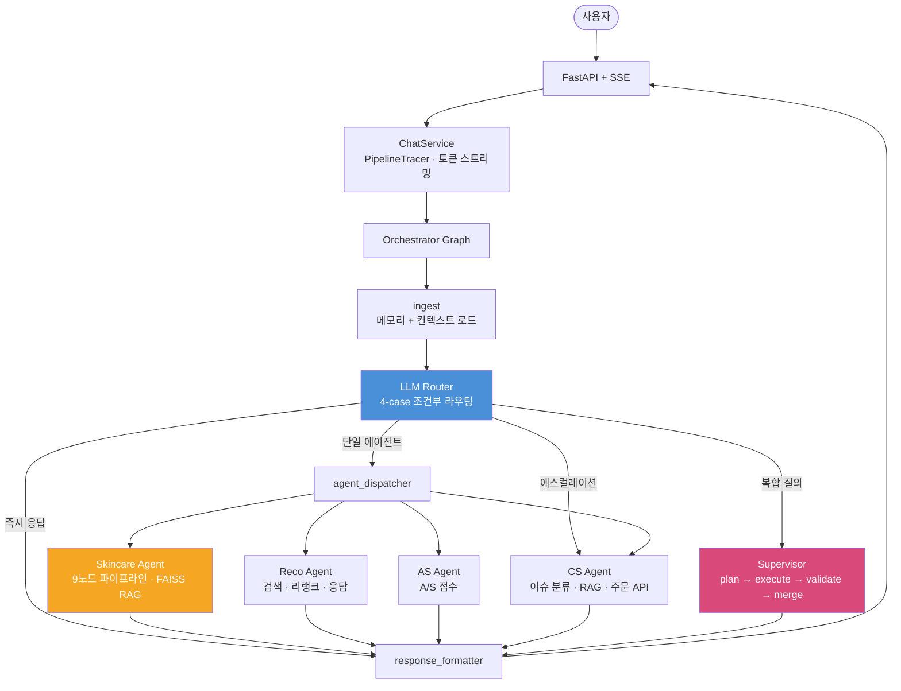

# LLM Multi-Agent 아키텍처 설계 사례  

- Production 환경을 전제로 설계한 멀티에이전트 오케스트레이션 구조와 routing · supervisor · RAG · latency 최적화 사례 정리
> skeleton 코드 + 다이어그램 + 벤치마크 중심의 아키텍처 쇼케이스.
> 비즈니스 로직·LLM 프롬프트·사내 데이터는 제거됨.

## TL;DR

- D2C 스킨케어 브랜드의 4-도메인(피부 상담 · 제품 추천 · A/S · CS) 멀티에이전트 챗봇
- LangChain → LangGraph StateGraph 전환으로 슬롯 손실, 라우팅 레이턴시, 복합 질의 미처리 문제 해결
- 4-case 조건부 라우팅으로 턴당 LLM 호출 5회 → 0-2회, warm-path TTFT 최대 95.7% 감소
- RAGAS faithfulness 0.96, 라우팅 정확도 100% (50/50 시나리오)
- 상세: [ARCHITECTURE.md](ARCHITECTURE.md) · [DECISIONS.md](DECISIONS.md) · [PERFORMANCE.md](PERFORMANCE.md)

---

## Why this architecture exists

D2C 스킨케어 브랜드의 CS 챗봇. 4개 도메인(피부 상담 · 제품 추천 · A/S · CS)이
**하나의 세션**에서 공존해야 했다. 
LangChain `AgentExecutor`로 시작했고, 3가지가 문제점이 있었다. 

- 에이전트 전환 시 슬롯 손실 (flat dict 상태 관리)
- 라우팅 레이턴시 20초+ (매 턴 LLM 5회 호출)
- 복합 질의 반쪽 처리 (라우터가 에이전트 하나만 선택)

**전환**: LangGraph `StateGraph` — 노드/엣지 명시적 제어, Pydantic 상태 모델,
에이전트별 체크포인트 분리, 조건부 엣지로 핸드오프 결정론적 처리.

→ 전환 판단의 근거: [DECISIONS.md](DECISIONS.md)

---

## Architecture

→ 레이어별 상세: [ARCHITECTURE.md](ARCHITECTURE.md)

---

## Impact

| 지표 | 결과 |
|---|---|
| 라우팅 정확도 | **100%** (50/50 시나리오) |
| RAG Faithfulness | **0.96** (RAGAS 기반, n=20) |
| CS TTFT 개선 | 20.8s → **0.9s** (-95.7%) |
| Reco TTFT 개선 | 16.8s → **1.9s** (-88.5%) |
| 턴당 LLM 호출 | 5회 → **0~2회** |

→ 최적화 기법과 벤치마크: [PERFORMANCE.md](PERFORMANCE.md)

---

## 문서

| 문서 | 내용 |
|---|---|
| [ARCHITECTURE.md](ARCHITECTURE.md) | 시스템 레이어, 에이전트별 파이프라인, Infrastructure, Code Map |
| [DECISIONS.md](DECISIONS.md) | 5가지 핵심 설계 판단과 근거 |
| [PERFORMANCE.md](PERFORMANCE.md) | 6가지 최적화 기법 + 벤치마크 |
| [diagrams/](diagrams/) | orchestrator · skincare · router · supervisor · cache · SSE 다이어그램 |
| [skeleton/](skeleton/) | 전체 skeleton 코드 (37 파일) |

**기술 스택**: Python 3.11 · LangGraph · FastAPI · Redis · FAISS · ChromaDB · OpenAI gpt · SSE streaming
