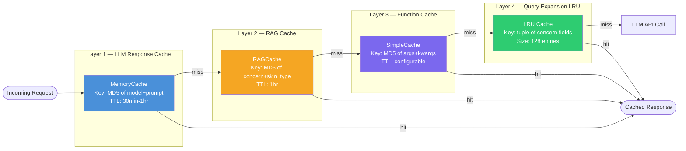

# 4-Layer Cache Architecture



## Key Design: No `session_id` in Cache Keys

Cache keys deliberately **exclude session_id** so that identical queries from
different users share the same cache entry. This is why warm-path TTFT can drop
below 1 second for CS/Reco — the first user "primes" the cache for everyone.

```
memory_cache : MD5(model | system_prompt | user_prompt)
rag_cache    : MD5(concern | skin_type | primary_concern)
simple_cache : MD5(JSON(args, kwargs))
lru_cache    : tuple(primary_concern, skin_type, concerns_key, avoid_key)
```
