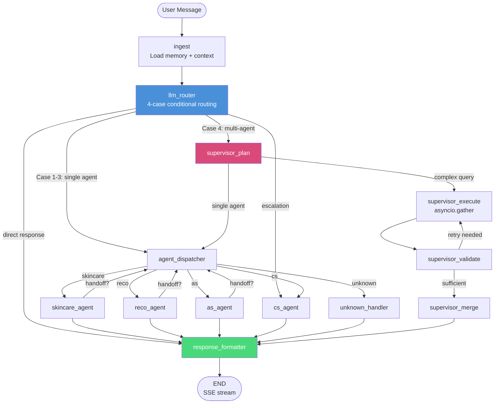

# Orchestrator StateGraph Flow

```mermaid
graph TD
    START([User Message]) --> INGEST[ingest<br/>Load memory + context]
    INGEST --> ROUTER[llm_router<br/>4-case conditional routing]

    ROUTER -->|Case 1-3: single agent| DISPATCH[agent_dispatcher]
    ROUTER -->|Case 4: multi-agent| SPLAN[supervisor_plan]
    ROUTER -->|direct response| FORMAT[response_formatter]
    ROUTER -->|escalation| CS[cs_agent]

    DISPATCH -->|skincare| SK[skincare_agent]
    DISPATCH -->|reco| RECO[reco_agent]
    DISPATCH -->|as| AS[as_agent]
    DISPATCH -->|cs| CS
    DISPATCH -->|unknown| UNK[unknown_handler]

    SK -->|handoff?| DISPATCH
    RECO -->|handoff?| DISPATCH
    AS -->|handoff?| DISPATCH
    SK --> FORMAT
    RECO --> FORMAT
    AS --> FORMAT
    CS --> FORMAT
    UNK --> FORMAT

    SPLAN -->|complex query| SEXEC[supervisor_execute<br/>asyncio.gather]
    SPLAN -->|single agent| DISPATCH
    SEXEC --> SVAL[supervisor_validate]
    SVAL -->|retry needed| SEXEC
    SVAL -->|sufficient| SMERGE[supervisor_merge]
    SMERGE --> FORMAT

    FORMAT --> DONE([END<br/>SSE stream])

    style ROUTER fill:#4a90d9,color:#fff
    style SPLAN fill:#d94a7a,color:#fff
    style FORMAT fill:#4ad97a,color:#fff
```
