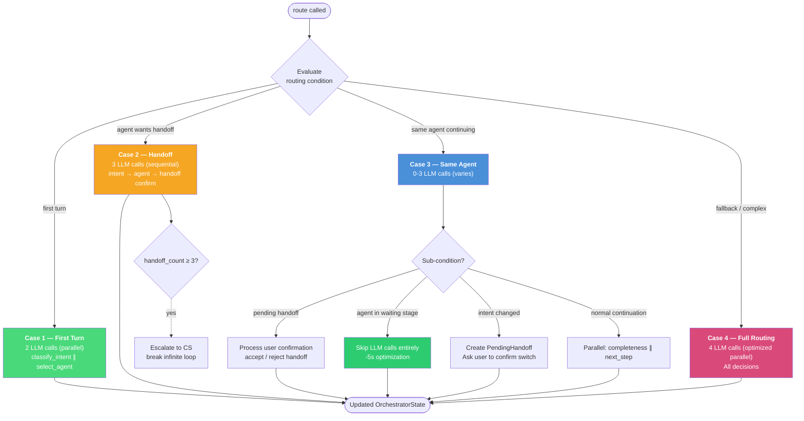

# LLM Router — 4-Case Conditional Routing

```mermaid
flowchart TD
    IN([route called]) --> CHK{Evaluate<br/>routing condition}

    CHK -->|first turn| C1["<b>Case 1 — First Turn</b><br/>2 LLM calls (parallel)<br/>classify_intent ∥ select_agent"]
    CHK -->|agent wants handoff| C2["<b>Case 2 — Handoff</b><br/>3 LLM calls (sequential)<br/>intent → agent → handoff confirm"]
    CHK -->|same agent continuing| C3["<b>Case 3 — Same Agent</b><br/>0-3 LLM calls (varies)"]
    CHK -->|fallback / complex| C4["<b>Case 4 — Full Routing</b><br/>4 LLM calls (optimized parallel)<br/>All decisions"]

    C3 --> C3A{Sub-condition?}
    C3A -->|pending handoff| C3P[Process user confirmation<br/>accept / reject handoff]
    C3A -->|agent in waiting stage| C3W[Skip LLM calls entirely<br/>-5s optimization]
    C3A -->|intent changed| C3I[Create PendingHandoff<br/>Ask user to confirm switch]
    C3A -->|normal continuation| C3N[Parallel: completeness ∥ next_step]

    C1 --> OUT([Updated OrchestratorState])
    C2 --> OUT
    C3P --> OUT
    C3W --> OUT
    C3I --> OUT
    C3N --> OUT
    C4 --> OUT

    LOOP{handoff_count ≥ 3?} -.->|yes| ESC[Escalate to CS<br/>break infinite loop]
    C2 --> LOOP

    style C1 fill:#4ad97a,color:#fff
    style C2 fill:#f5a623,color:#fff
    style C3 fill:#4a90d9,color:#fff
    style C4 fill:#d94a7a,color:#fff
    style C3W fill:#2ecc71,color:#fff
```
