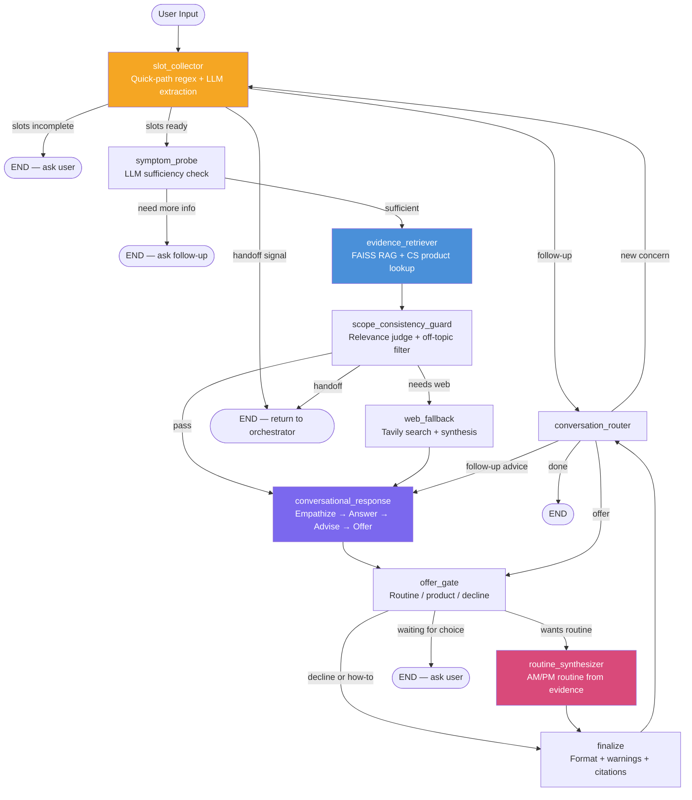

# Skincare Agent — Internal 7-Node Pipeline

```mermaid
graph TD
    START([User Input]) --> SC[slot_collector<br/>Quick-path regex + LLM extraction]

    SC -->|slots incomplete| WAIT([END — ask user])
    SC -->|follow-up| CR[conversation_router]
    SC -->|handoff signal| EXIT([END — return to orchestrator])
    SC -->|slots ready| SP[symptom_probe<br/>LLM sufficiency check]

    SP -->|need more info| WAIT2([END — ask follow-up])
    SP -->|sufficient| ER[evidence_retriever<br/>FAISS RAG + CS product lookup]

    ER --> SCG[scope_consistency_guard<br/>Relevance judge + off-topic filter]

    SCG -->|handoff| EXIT
    SCG -->|needs web| WF[web_fallback<br/>Tavily search + synthesis]
    SCG -->|pass| CONV[conversational_response<br/>Empathize → Answer → Advise → Offer]

    WF --> CONV

    CONV --> OG[offer_gate<br/>Routine / product / decline]

    OG -->|wants routine| RS[routine_synthesizer<br/>AM/PM routine from evidence]
    OG -->|decline or how-to| FIN[finalize<br/>Format + warnings + citations]
    OG -->|waiting for choice| WAIT3([END — ask user])

    RS --> FIN
    FIN --> CR
    CR -->|new concern| SC
    CR -->|follow-up advice| CONV
    CR -->|offer| OG
    CR -->|done| DONE([END])

    style SC fill:#f5a623,color:#fff
    style ER fill:#4a90d9,color:#fff
    style CONV fill:#7b68ee,color:#fff
    style RS fill:#d94a7a,color:#fff
```
