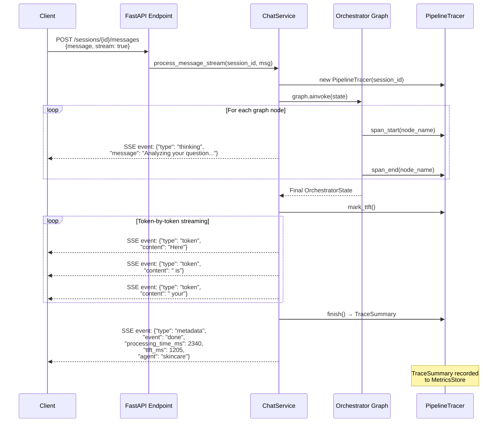

# SSE Streaming Sequence

```mermaid
sequenceDiagram
    participant Client
    participant API as FastAPI Endpoint
    participant CS as ChatService
    participant OG as Orchestrator Graph
    participant Tracer as PipelineTracer

    Client->>API: POST /sessions/{id}/messages<br/>{message, stream: true}
    API->>CS: process_message_stream(session_id, msg)
    CS->>Tracer: new PipelineTracer(session_id)
    CS->>OG: graph.ainvoke(state)

    loop For each graph node
        OG->>Tracer: span_start(node_name)
        CS-->>Client: SSE event: {"type": "thinking",<br/>"message": "Analyzing your question..."}
        OG->>Tracer: span_end(node_name)
    end

    OG-->>CS: Final OrchestratorState

    CS->>Tracer: mark_ttft()
    loop Token-by-token streaming
        CS-->>Client: SSE event: {"type": "token",<br/>"content": "Here"}
        CS-->>Client: SSE event: {"type": "token",<br/>"content": " is"}
        CS-->>Client: SSE event: {"type": "token",<br/>"content": " your"}
    end

    CS->>Tracer: finish() → TraceSummary
    CS-->>Client: SSE event: {"type": "metadata",<br/>"event": "done",<br/>"processing_time_ms": 2340,<br/>"ttft_ms": 1205,<br/>"agent": "skincare"}

    Note over Tracer: TraceSummary recorded<br/>to MetricsStore
```
