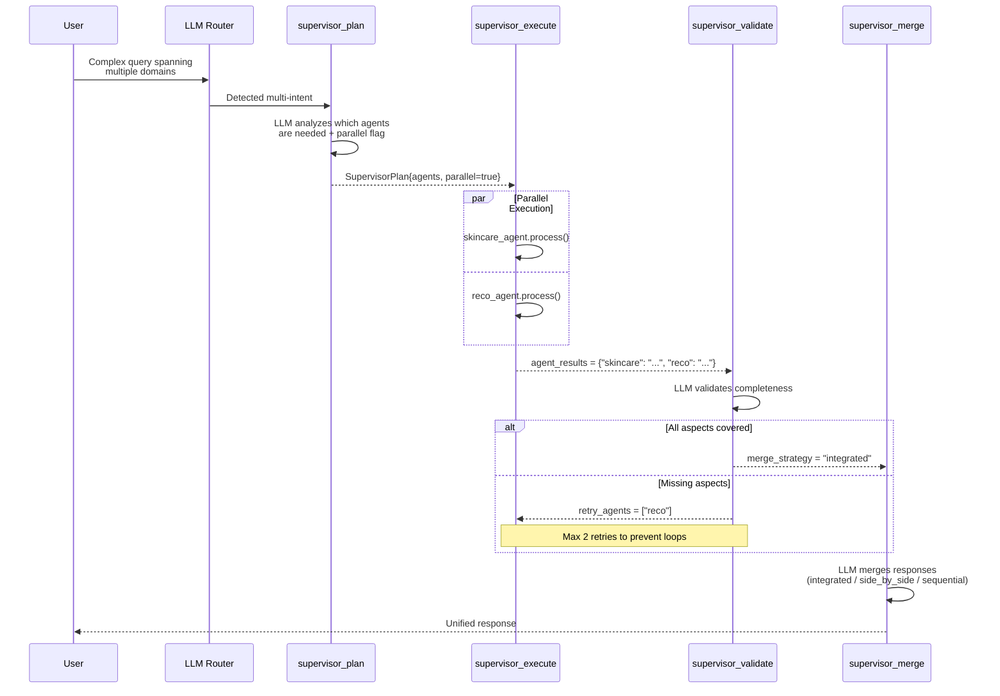

# Multi-Agent Supervisor Pattern

```mermaid
sequenceDiagram
    participant U as User
    participant R as LLM Router
    participant SP as supervisor_plan
    participant SE as supervisor_execute
    participant SV as supervisor_validate
    participant SM as supervisor_merge

    U->>R: Complex query spanning<br/>multiple domains
    R->>SP: Detected multi-intent

    SP->>SP: LLM analyzes which agents<br/>are needed + parallel flag
    SP-->>SE: SupervisorPlan{agents, parallel=true}

    par Parallel Execution
        SE->>SE: skincare_agent.process()
    and
        SE->>SE: reco_agent.process()
    end

    SE-->>SV: agent_results = {"skincare": "...", "reco": "..."}

    SV->>SV: LLM validates completeness
    alt All aspects covered
        SV-->>SM: merge_strategy = "integrated"
    else Missing aspects
        SV-->>SE: retry_agents = ["reco"]
        Note over SE,SV: Max 2 retries to prevent loops
    end

    SM->>SM: LLM merges responses<br/>(integrated / side_by_side / sequential)
    SM-->>U: Unified response
```
